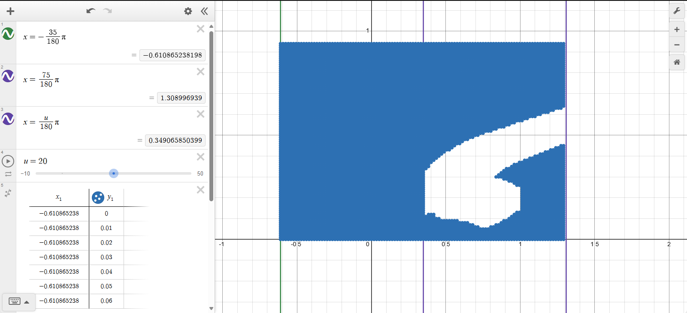
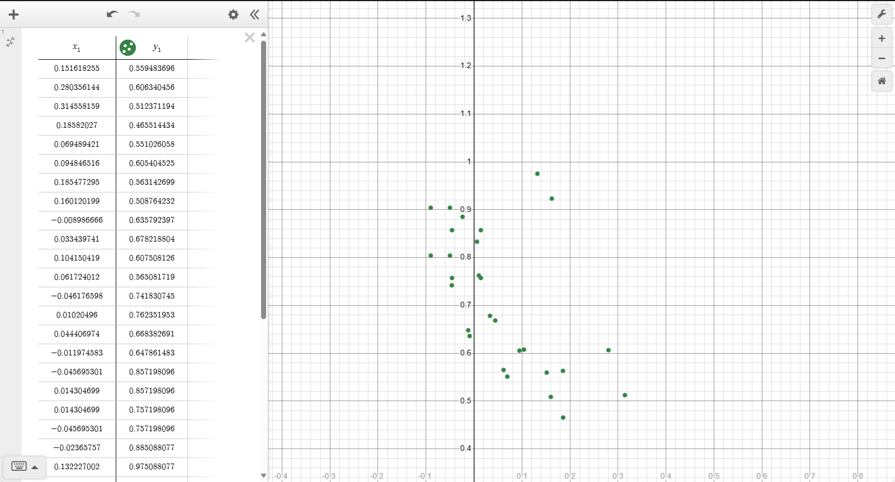
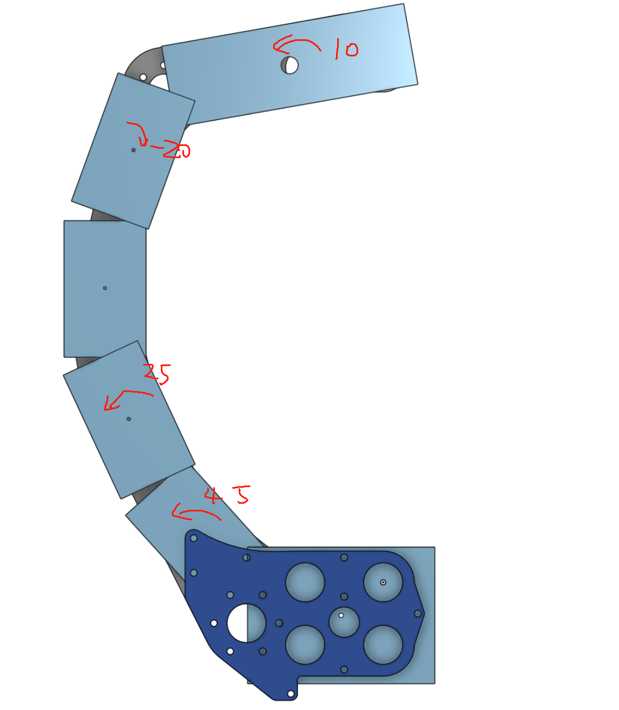
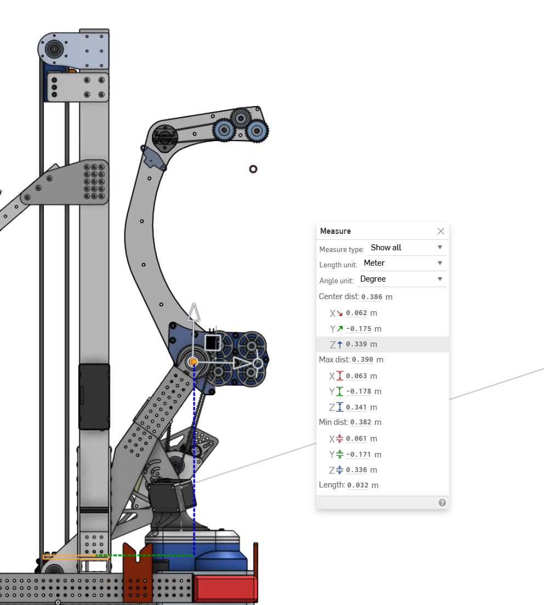
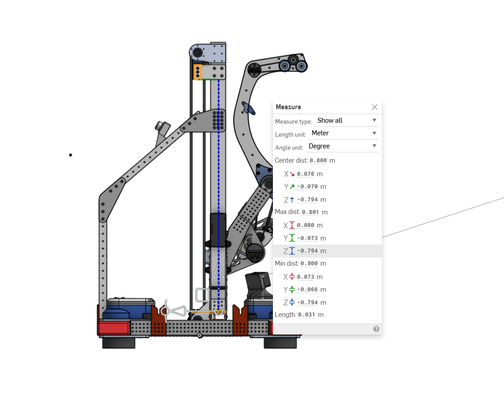

# Collision Detection

## Use
- ### project folder: 
    `./CollisionDetection/demo`
- ### documents: 
    `./docs/index.html`

## Pics

### Domain
 \
- domain for valid workspace genrated by outputDomain() in `./demo/src/drawDomain.java`

 \
- vertices of rectangle in the scene \
    with given angle/height of AOR, genrated by outputPoints() in `./demo/src/drawDomain.java`

### AOR
 \
- how to approximate your moving mechanism with boxes
    angles are `local rotation`
- `center` for `OBB` is from the center of bonded AOR to the center of the rectangle

### Global Offset

### Obstacle

### Geometry
X-positive pointing left and it's the degree zero
be aware of sequence in Separating Axis Algorithm when changing to new rotation matrix

## Todo
ID-Object mapping for AOR/BoundingBox objects

## Suggested Graphing Parameters
domain: 0 meter to 0.74m (Meters)
range: -35deg to 70deg (Radians)

## Steps to make it work for actual mechanism
A-star and path interpolating (lagrange)